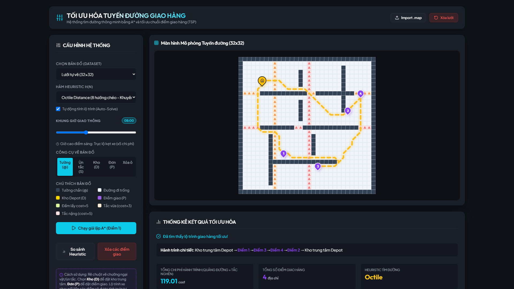
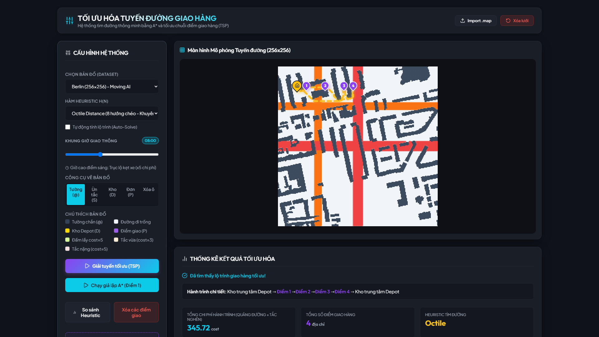
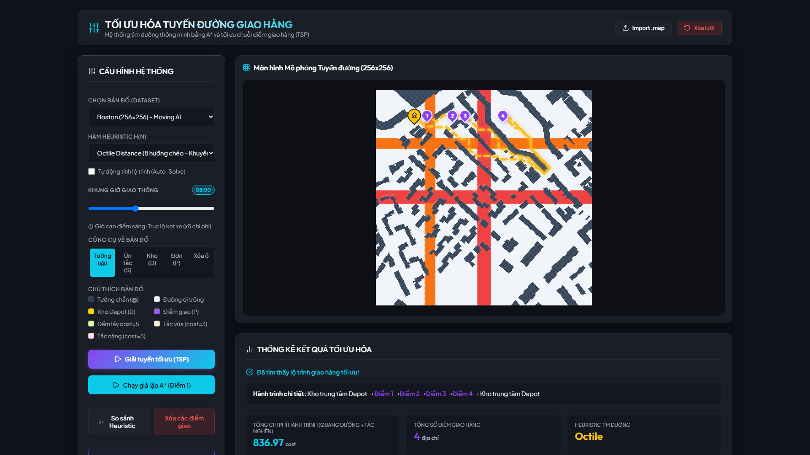
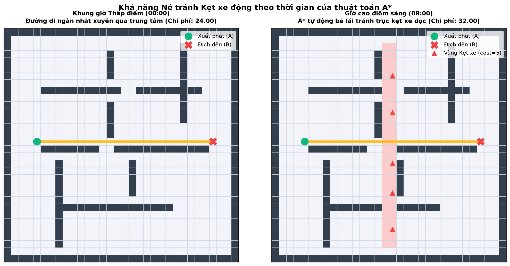
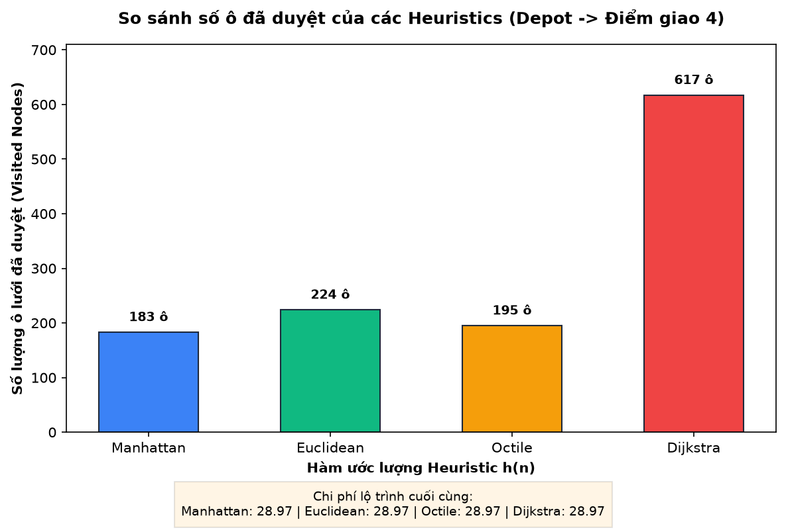

# 🚚 Delivery Route Optimization with A* & TSP

[](https://react.dev/)
[](https://vitejs.dev/)
[](https://www.python.org/)
[](https://developer.mozilla.org/en-US/docs/Web/API/Canvas_API)
[](https://opensource.org/licenses/MIT)

**Delivery Route Optimization** là một hệ thống tối ưu hóa tuyến đường giao hàng thông minh kết hợp giữa thuật toán tìm đường **A\*** (cho di chuyển 8 hướng trên lưới 2D) và bộ giải bài toán người bán hàng du lịch **TSP** (**Nearest Neighbor** + local search refinement **2-Opt**). 

Hệ thống mô phỏng bản đồ đô thị thực tế tích hợp chỉ số ùn tắc giao thông động thay đổi theo các khung giờ cao điểm (sáng, trưa, chiều) giúp lập lộ trình giao hàng tối ưu và né tránh kẹt xe thời gian thực.

---

## 🌟 Tính năng nổi bật

* **Tìm đường 8 hướng bằng thuật toán A\***: Sử dụng các hàm heuristic ước lượng thông minh bao gồm **Manhattan, Euclidean, Chebyshev, Octile** (tối ưu nhất cho lưới 8 hướng) và **Dijkstra** (h=0).
* **Mô phỏng kẹt xe động theo khung giờ**: Mô tả thực tế giao thông giờ cao điểm sáng (7h-9h), trưa (11h-13h) và chiều (17h-19h) tại trung tâm và các trục chính đô thị.
* **Bộ giải TSP khép kín**: Giải và lập trình chuỗi điểm giao hàng tối ưu xuất phát từ kho trung tâm (Depot), đi qua các điểm giao hàng và trở về Depot với chi phí tối thiểu.
* **Đồ họa Web UI 60 FPS mượt mà**: Sử dụng kỹ thuật **Offscreen Canvas Double-Buffering** để render mượt mà bản đồ thành phố lớn 256x256 (65.536 ô) mà không gây lag trình duyệt.
* **Hiệu ứng Marching Ants & HTML Pin Overlays**: Đường lộ trình di chuyển màu vàng neon phát sáng sống động cùng hệ thống Depot/Stop bounce animation tiện lợi.
* **Đầy đủ kịch bản Python**: Kết xuất ảnh đồ thị học thuật thông qua Matplotlib và các tool chụp ảnh kiểm thử tự động Playwright.

---

## 📸 Hình ảnh giao diện & Kết quả thực nghiệm

### 1. Tổng quan Dashboard Web (Lưới tự vẽ 32x32)
Giao diện quản lý thông số trực quan, tùy chỉnh Heuristics, thay đổi giờ kẹt xe, vẽ/xóa tường trực tiếp và hiển thị tuyến đường tối ưu TSP khép kín:


### 2. Tối ưu hóa trên bản đồ thành phố thực tế (Moving AI Lab)
Hệ thống nạp và giải lộ trình thời gian thực trên các bản đồ chuẩn của thành phố **Berlin** (Đức) và **Boston** (Mỹ):



### 3. Khả năng tự động né tránh kẹt xe của thuật toán
Đường đi tự động bẻ cua né tránh các cung đường chính đang báo động đỏ kẹt xe `⚠` vào giờ cao điểm:


### 4. So sánh hiệu năng các hàm Heuristics
Biểu đồ so sánh số lượng nút cần mở rộng của từng Heuristic trên cùng một kịch bản tìm kiếm:


---

## 📂 Cấu trúc thư mục dự án

```text
BTL/
├── web/                        Ứng dụng Web Dashboard (React + Vite)
│   ├── src/
│   │   ├── algorithms/
│   │   │   ├── astar.js        Thuật toán A* (JavaScript)
│   │   │   └── tsp.js          Bộ giải TSP (JavaScript)
│   │   ├── data/
│   │   │   ├── presets.js      Cấu hình bản đồ Preset
│   │   │   └── parser.js       Parser tệp .map Moving AI
│   │   ├── App.jsx             Component chính giao diện
│   │   ├── App.css             CSS giao diện
│   │   └── index.css           Design tokens toàn cục
│   └── public/maps/            Các tệp bản đồ Moving AI (.map)
├── dataset/                    Tập dữ liệu bản đồ Moving AI Lab
└── IMG/                        Ảnh đầu ra phục vụ viết báo cáo
```

---

## 🚀 Hướng dẫn cài đặt & Khởi chạy

### 💻 Chạy Giao diện Web (Front-end)

1. Di chuyển vào thư mục `web/`:
   ```bash
   cd web
   ```
2. Cài đặt các gói phụ thuộc:
   ```bash
   npm install
   ```
3. Khởi chạy máy chủ phát triển cục bộ:
   ```bash
   npm run dev
   ```
4. Truy cập trình duyệt tại địa chỉ: **[http://localhost:5173/](http://localhost:5173/)**

---

## 🛠️ Thuật toán sử dụng

### 1. Hàm ước lượng Heuristic A*
* **Octile Distance (Mặc định)**:
  $$\Delta x = |x_1 - x_2|, \quad \Delta y = |y_1 - y_2|$$
  $$h(n) = (\Delta x + \Delta y) + (\sqrt{2} - 2) \times \min(\Delta x, \Delta y)$$
* **Euclidean Distance**:
  $$h(n) = \sqrt{(\Delta x)^2 + (\Delta y)^2}$$
* **Manhattan Distance**:
  $$h(n) = \Delta x + \Delta y$$

### 2. Bộ giải bài toán TSP (Travelling Salesman Problem)
* **Nearest Neighbor**: Xây dựng lộ trình tham lam ban đầu có độ phức tạp $O(n^2)$.
* **2-Opt refinement**: Tối ưu cục bộ loại bỏ các đường chéo giao cắt nhau giúp rút ngắn tối đa chiều dài tổng hành trình.

---


